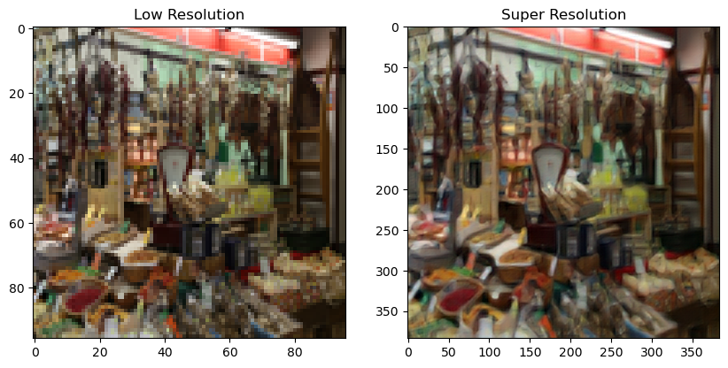
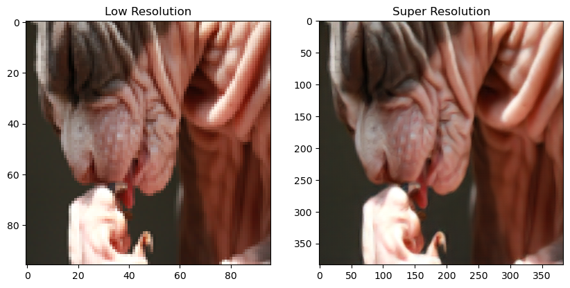
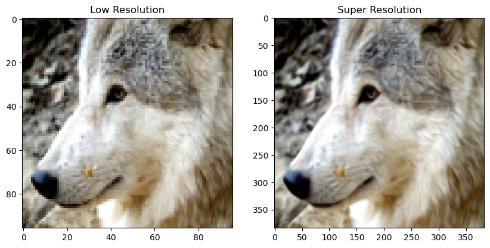

# SRGAN

A Tenserflow implementation of SRGAN based on CVPR 2017 paper "Photo-Realistic Single Image Super-Resolution Using a Generative Adversarial Network".

# Usage

Enviroment

    python          3.9.13
    tensorflow      2.11.0
    numpy           1.21.5
    opencv-python   4.6.0.66

## Train 

Put train image([DIV2K DataSet](https://www.kaggle.com/datasets/joe1995/div2k-dataset)) dataset at ./train folder.

To train dataset, type the code below on your cmd.

    python train.py

optional arguments:

    --epochs                 epochs
    --batchs                 batchs
    --lr_g                   learning rate of generator
    --lr_d                   learning rate of discriminator
    --train_dir              directory of image to train / 학습 할 이미지 위치
    --load_model             load saved model / 저장된 모델 불러오기 (1: True, 0: False)
    --use_cpu                forced to use CPU only / CPU 만 이용해 학습하기 (1: True, 0: False)

## Test Single Image

Put test image in ./test folder.

To test dataset, type the code below on your cmd.

    python test.py

The result will be saved in ./result folder.

optional arguments:

    --target_folder         directory of image to process super resolution / super resolution 처리할 이미지 위치
    --save_folder           directory to save super resoultion image / super resolution 처리된 이미지 저장 위치
